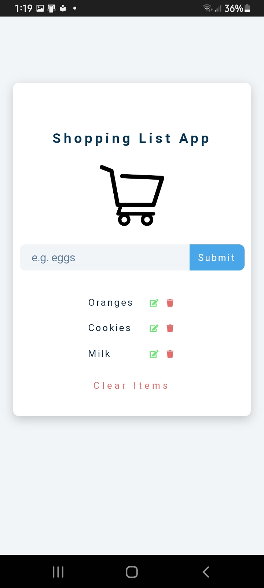

# Add-to-Cart-Mobile-App

## Table of Contents

- [Introduction](#introduction)
- [Features](#features)
- [Technologies](#technologies)
- [Installation](#installation)
- [Usage](#usage)
- [Screenshots](#screenshots)
- [Contributing](#contributing)
- [License](#license)

## Introduction

Add to Cart Mobile App is a simple mobile application built to allow users to create a shopping list by adding items to their cart. The app is designed to be user-friendly and easy to navigate, providing a seamless shopping experience for users. It is written in JavaScript with HTML and CSS for structure, design, and style.

## Features

The Add to Cart Mobile App offers the following features:

- Add items to the shopping cart: Users can enter items they wish to add to their shopping list.
- Edit items in the cart: Users can modify the details of items already added to the cart.
- Remove items from the cart: Users can remove items from the shopping list/cart.
- Clear the entire cart: Users can clear the entire shopping cart with a single button.
- Persist data using Firebase Realtime Database: The app stores the shopping list data in the Firebase Realtime Database, allowing users to access their lists from different devices.

## Technologies

The Add to Cart Mobile App is built using the following technologies:

- Firebase Realtime Database: A cloud-hosted NoSQL database that allows real-time synchronization of data.
- JavaScript: The programming language used to develop the application's logic.
- HTML and CSS: Used to structure and style the user interface.

## Installation

To run the Add to Cart Mobile App on your local machine, follow these steps:

1. Clone the repository:

```bash
git clone https://github.com/JosephMusenge/Add-to-Cart-Mobile-App.git
```

2. Navigate to the project directory:

```bash
cd Add-to-Cart-Mobile-App
```

3. Configure Firebase:

   - Create a new Firebase project at https://console.firebase.google.com/
   - Obtain your Firebase project's configuration details, including API keys.
   - Replace the Firebase configuration in the app with your own credentials.

4. Run the app:

  - Open the application in your web browser or add the app to your android and ios home page to run it.

## Usage

Once the app is running, you will be presented with a simple user interface to manage your shopping cart. You can perform the following actions:

- **Adding Items:** Type the name of the item you wish to add into the input field and press the "Add" button.
- **Editing Items:** To edit an item, tap on the edit button next to the item in the list, modify the details, and press the "Submit" button.
- **Removing Items:** To delete an item from the cart, swipe the item to the left, and a "Delete" option will appear. Tap on "Delete" to remove the item.
- **Clearing the Cart:** To clear the entire cart, press the "Clear Cart" button.

## Screenshots

.png)


## Contributing

Contributions to the Add to Cart Mobile App are welcome. If you have any bug fixes, improvements, or new features to add, please follow these steps:

1. Fork the repository.
2. Create a new branch for your feature: `git checkout -b feature-name`
3. Implement your changes and commit them: `git commit -m "Add your message here"`
4. Push to the branch: `git push origin feature-name`
5. Create a pull request to the `main` branch of the original repository.

## License

The Add to Cart Mobile App is open-source software licensed under the [MIT License](LICENSE). Feel free to use, modify, and distribute the code as per the terms of the license.
